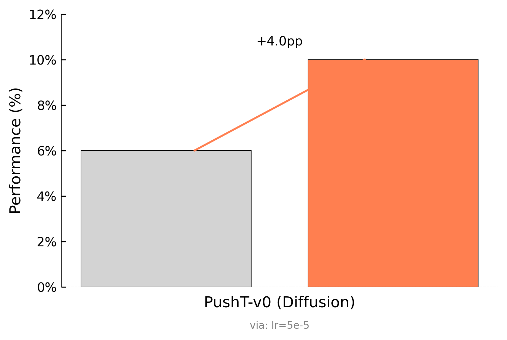

# AutoResearch-MRL: Live Results

> Last updated: **2026-03-18 06:40 UTC** | auto-generated every 5 min

## Summary

| Metric | Value |
|--------|-------|
| **Current Phase** | Phase 2: Optimization |
| Total experiments | 18 |
| Baselines complete | 9 / 9 |
| Improvements kept | 1 |
| Discarded | 8 |
| Crashes | 0 |
| Total GPU time | 842 min (14.0 hrs) |

## Policy Comparison

## Baseline Results

| Policy | Task | Success Rate | Avg Reward | VRAM (GB) | Time (min) | Steps |
|--------|------|:------------:|:----------:|:---------:|:----------:|:-----:|
| diffusion | PushT-v0 | 6.0% | 47.3 | 0.0 | 35 | 28405 |
| act | PushT-v0 | 0.0% | 25.8 | 0.0 | 35 | 16922 |
| vqbet | PushT-v0 | 0.0% | 1.9 | 0.0 | 35 | 25970 |
| diffusion | AlohaTransferCube-v0 | 2.0% | 29.4 | 0.0 | 65 | 10682 |
| act | AlohaTransferCube-v0 | 22.0% | 94.2 | 0.0 | 65 | 15213 |
| vqbet | AlohaTransferCube-v0 | 0.0% | 0.0 | 0.0 | 65 | 7570 |
| diffusion | AlohaInsertion-v0 | 0.0% | 6.3 | 0.0 | 65 | 11018 |
| act | AlohaInsertion-v0 | 4.0% | 116.0 | 0.0 | 65 | 15616 |
| vqbet | AlohaInsertion-v0 | 0.0% | 0.0 | 0.0 | 65 | 7914 |

## Training Efficiency

## Optimization Results

| Policy | Task | Best Success Rate | Improvement | Description |
|--------|------|:-----------------:|:-----------:|-------------|
| act | AlohaInsertion-v0 | 4.0% | baseline | default act on AlohaInsertion-v0 |
| act | AlohaTransferCube-v0 | 22.0% | baseline | default act on AlohaTransferCube-v0 |
| act | PushT-v0 | 8.0% | +8.0pp | chunk_size=20 |
| diffusion | AlohaInsertion-v0 | 0.0% | baseline | default diffusion on AlohaInsertion-v0 |
| diffusion | AlohaTransferCube-v0 | 4.0% | +2.0pp | lr=5e-4 |
| diffusion | PushT-v0 | 28.0% | +22.0pp | horizon=32 |
| vqbet | AlohaInsertion-v0 | 0.0% | baseline | default vqbet on AlohaInsertion-v0 |
| vqbet | AlohaTransferCube-v0 | 0.0% | baseline | default vqbet on AlohaTransferCube-v0 |
| vqbet | PushT-v0 | 0.0% | baseline | default vqbet on PushT-v0 |

## Experiment Progress

## Full Experiment Log

Click to expand all experiments

| # | Commit | Policy | Task | Success | Reward | Status | Description |
|---|--------|--------|------|:-------:|:------:|:------:|-------------|
| 1 | `c7275a1` | diffusion | PushT-v0 | 6.0% | 47.3 | baseline | default diffusion on PushT-v0 |
| 2 | `814f618` | act | PushT-v0 | 0.0% | 25.8 | baseline | default act on PushT-v0 |
| 3 | `5dcae14` | vqbet | PushT-v0 | 0.0% | 1.9 | baseline | default vqbet on PushT-v0 |
| 4 | `7fb27b8` | diffusion | AlohaTransferCube-v0 | 2.0% | 29.4 | baseline | default diffusion on AlohaTransferCube-v0 |
| 5 | `ee4f0ea` | act | AlohaTransferCube-v0 | 22.0% | 94.2 | baseline | default act on AlohaTransferCube-v0 |
| 6 | `5bf4180` | vqbet | AlohaTransferCube-v0 | 0.0% | 0.0 | baseline | default vqbet on AlohaTransferCube-v0 |
| 7 | `4083c68` | diffusion | AlohaInsertion-v0 | 0.0% | 6.3 | baseline | default diffusion on AlohaInsertion-v0 |
| 8 | `f0cd1ec` | act | AlohaInsertion-v0 | 4.0% | 116.0 | baseline | default act on AlohaInsertion-v0 |
| 9 | `bf9ea9a` | vqbet | AlohaInsertion-v0 | 0.0% | 0.0 | baseline | default vqbet on AlohaInsertion-v0 |
| 10 | `02f0c05` | diffusion | PushT-v0 | 10.0% | 39.5 | **KEEP** | lr=5e-5 |
| 11 | `dde6bcb` | diffusion | PushT-v0 | 12.0% | 47.1 | discard | lr=5e-4 |
| 12 | `a545da1` | diffusion | PushT-v0 | 24.0% | 61.1 | discard | batch_size=32 |
| 13 | `b3328dd` | act | PushT-v0 | 2.0% | 28.7 | discard | lr=1e-3 |
| 14 | `620cd82` | act | PushT-v0 | 8.0% | 60.1 | discard | chunk_size=20 |
| 15 | `4b2e795` | diffusion | PushT-v0 | 22.0% | 64.4 | discard | n_obs_steps=1 |
| 16 | `e69cd48` | diffusion | PushT-v0 | 28.0% | 89.9 | discard | horizon=32 |
| 17 | `b32624c` | act | PushT-v0 | 6.0% | 53.4 | discard | chunk_size=50 |
| 18 | `60851e1` | diffusion | AlohaTransferCube-v0 | 4.0% | 14.1 | discard | lr=5e-4 |

---
*Generated automatically by [AutoResearch-MRL](program.md). Figures by [PaperBanana](https://github.com/vizuara/paperbanana).*