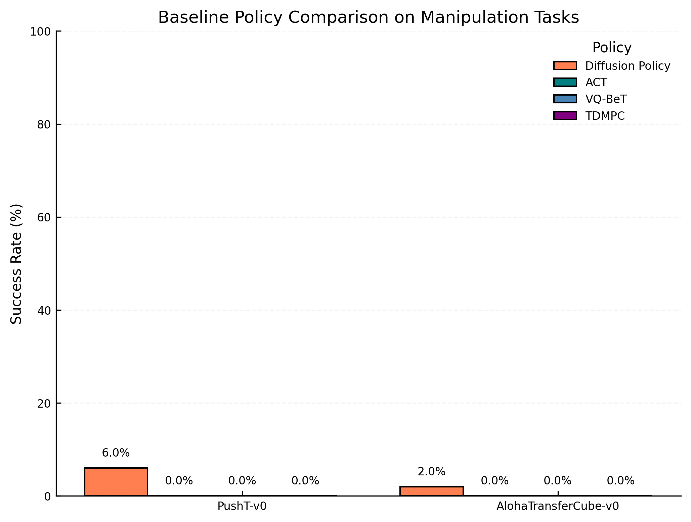
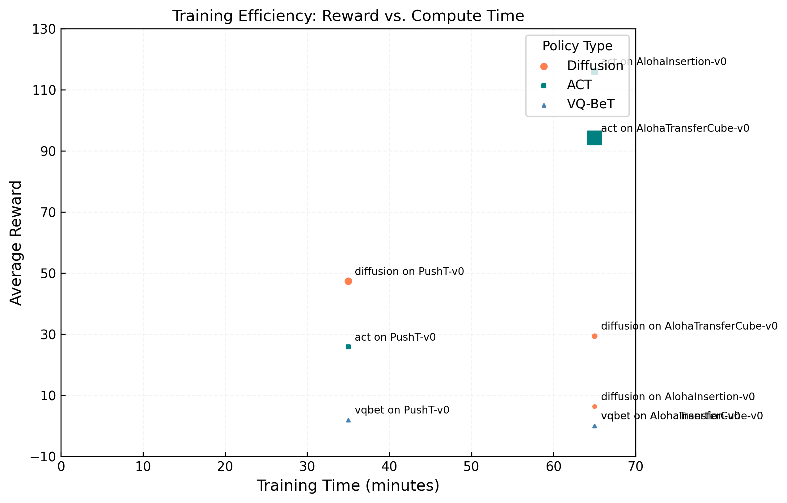
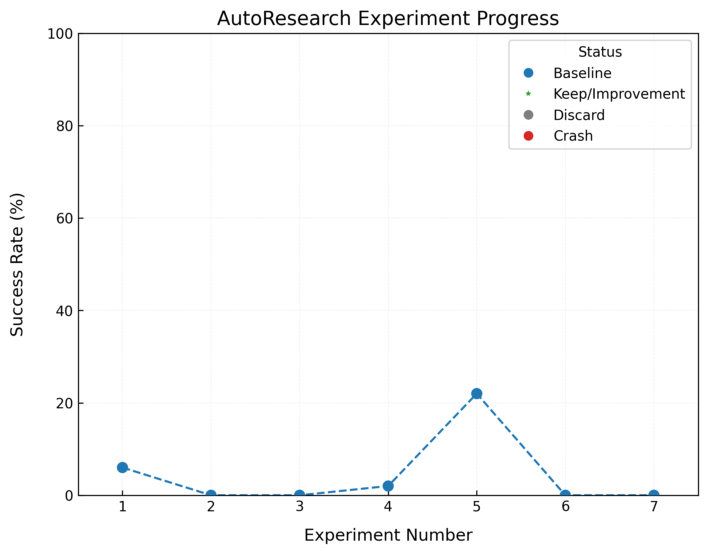

# AutoResearch-MRL: Live Results

> Last updated: **2026-03-14 06:57 UTC** | auto-generated every 5 min

## Summary

| Metric | Value |
|--------|-------|
| **Current Phase** | Phase 1: Baselines (3/9) |
| Total experiments | 3 |
| Baselines complete | 3 / 9 |
| Improvements kept | 0 |
| Discarded | 0 |
| Crashes | 0 |
| Total GPU time | 105 min (1.8 hrs) |

## Policy Comparison

## Baseline Results

| Policy | Task | Success Rate | Avg Reward | VRAM (GB) | Time (min) | Steps |
|--------|------|:------------:|:----------:|:---------:|:----------:|:-----:|
| diffusion | PushT-v0 | 6.0% | 47.3 | 0.0 | 35 | 28405 |
| act | PushT-v0 | 0.0% | 25.8 | 0.0 | 35 | 16922 |
| vqbet | PushT-v0 | 0.0% | 1.9 | 0.0 | 35 | 25970 |

## Training Efficiency

## Experiment Progress

## Full Experiment Log

Click to expand all experiments

| # | Commit | Policy | Task | Success | Reward | Status | Description |
|---|--------|--------|------|:-------:|:------:|:------:|-------------|
| 1 | `c7275a1` | diffusion | PushT-v0 | 6.0% | 47.3 | baseline | default diffusion on PushT-v0 |
| 2 | `814f618` | act | PushT-v0 | 0.0% | 25.8 | baseline | default act on PushT-v0 |
| 3 | `5dcae14` | vqbet | PushT-v0 | 0.0% | 1.9 | baseline | default vqbet on PushT-v0 |

---
*Generated automatically by [AutoResearch-MRL](program.md). Figures by [PaperBanana](https://github.com/vizuara/paperbanana).*